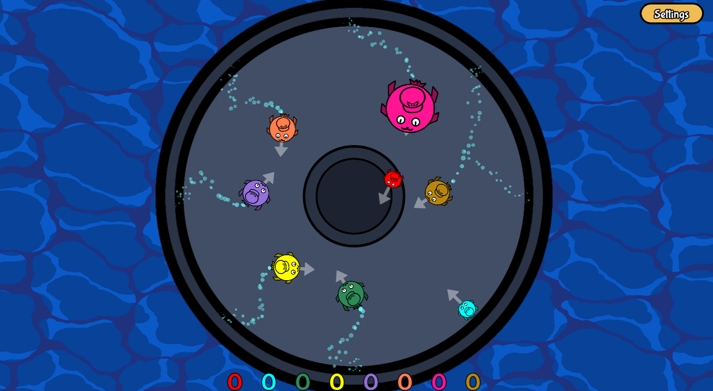
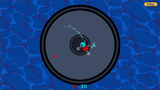
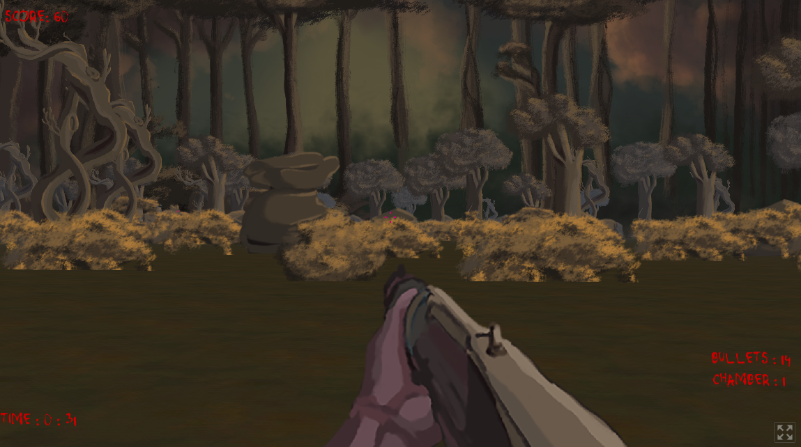
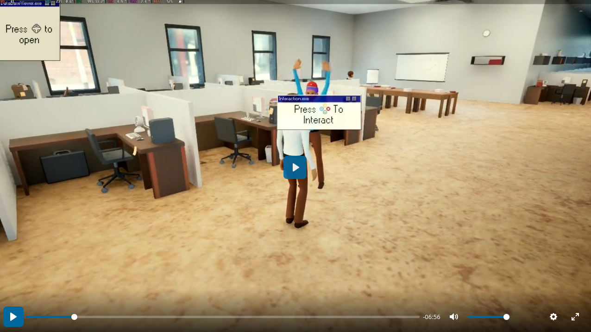
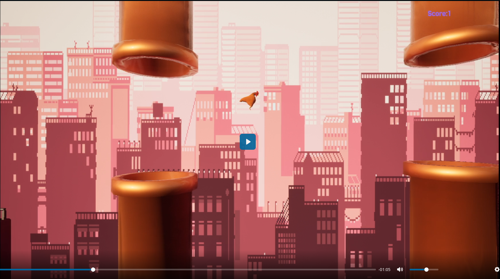
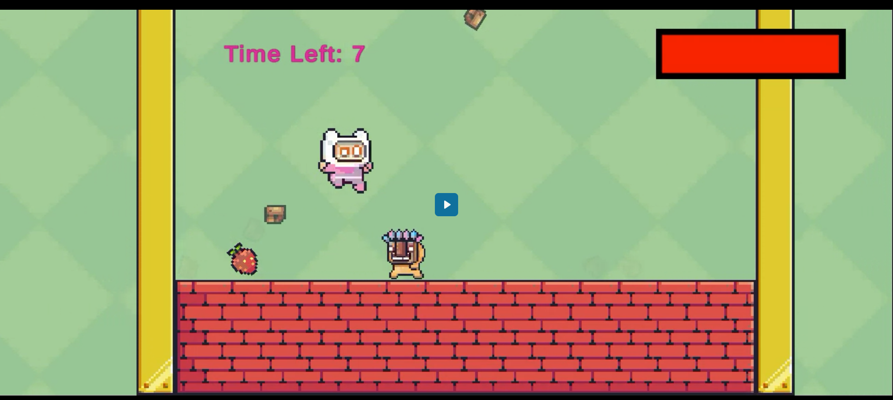

# Projects
you can look at my released games [on my itch.io profile Cedric45](https://itch.io/profile/cedric45)

Here's a few projects I've worked on:

## Released projects
These are mostly games available from gamejams. Since I tend to prototype or work on bigger projects when I work on personal projects.

### Puff Puff Push

A game originally made in 2 days for the dingo gamejam in Godot. it's a simple king of the hill game which can be played with up to 8 players and the control scheme is a joystick and a single button. you can play it [here](https://typimals.itch.io/puff-puff-push)
### Haunted

A game made in one week for the Godot Wild Jam #74 in Godot. It's technially a 3D game with 2D assets in a hand painted style. you can play it [here](https://cedric45.itch.io/haunted)

### Others...
you can look at all my released games [on my itch.io profile Cedric45](https://itch.io/profile/cedric45)

## Unreleased Projects
Here's projects which aren't available publicly.

### Nightmare Internship

An Unreal Engine 5 story game I made for a school project. I never released it since I thought the gameplay was too boring. However, It does look pretty nice 

### Floppy Code

An Unreal Engine 5 game I made to learn the engine. It's pretty much flappy bird but in 3D. I didn't release it since I felt it didn't add anything to the flappy bird formula.

### Labubu Hell

An Unity game I made for a school assignment. I had zero experience in Unity when making this game, but since I had alot of experience in game making, I made this game in about 8-10 hours. It's basically just dodging random objects and jumping on the head of enemies, I was focusing on learning Unreal instead of unity at the time so I didn't want to spend alot of time on unity

###